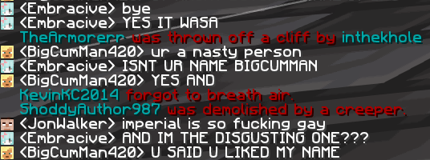

# RusherHack Chat Filter
This plugin allows you to filter chat messages in Minecraft using customizable regular expressions. It reads expressions from a file and applies them to incoming chat messages, blocking those that match.

### Before

### After

# Installation
1. Place the `rusherhack-chatfilter-x.x.x.jar` file into your RusherHack plugins directory.
2. Relaunch your game (`*reload` will not work, as this is a core plugin).
3. The plugin will automatically create a `filter.txt` file in the `config/chatfilter` directory, which you can edit to add your custom regex expressions.

By default there are no expressions, so you will need to add your own to filter messages. An example for 2b2t is provided [here](https://github.com/TehPicix/rusherhack-chat-filter/wiki/Example-Filter)
