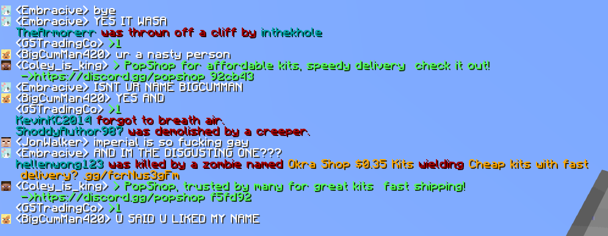
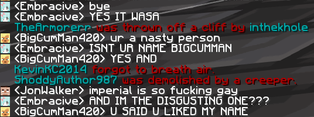

# Chat Filter

A rusherhack plugin that allows you to filter chat messages in Minecraft using customizable regular expressions. It reads expressions from a file and applies them to incoming chat messages, blocking those that match.

<!-- summary dfetails -->

  
Screenshots

### Before

### After

## Features
- ### Customizable Filters
  - Add your own regex expressions to filter out unwanted chat messages.
  - Supports complex patterns for advanced filtering.
  - Supports multi-line regex patterns.

# Installation
1. Place the `rusherhack-chatfilter-x.x.x.jar` file into your RusherHack plugins directory.
2. Relaunch your game (`*reload` will not work, as this is a core plugin).
3. The plugin will automatically create a `filter.txt` file in the `config/chatfilter` directory, which you can edit to add your custom regex expressions.

> [!NOTE]
> By default there are no expressions, you will need to add your own filters. \
> An example filter for 2b2t is available [here](https://github.com/TehPicix/rusherhack-chat-filter/wiki).
